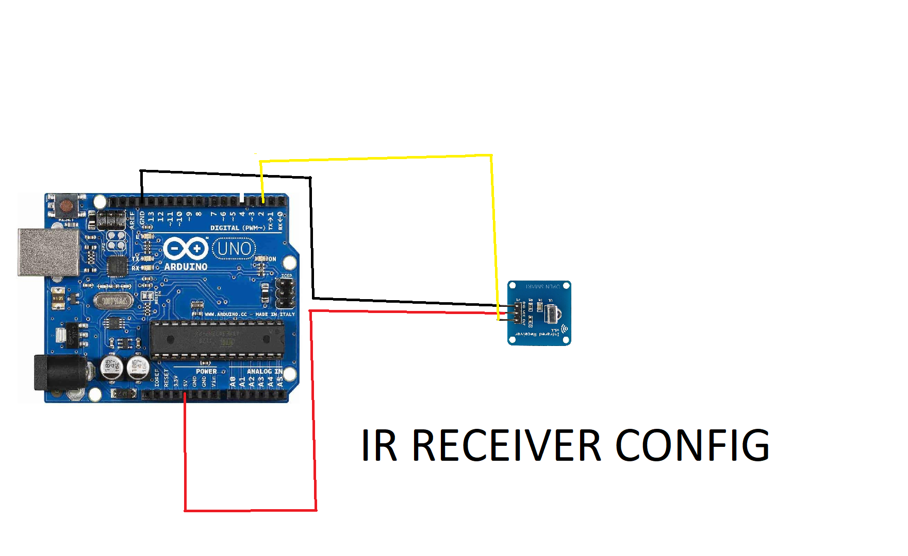

# Roku_Hacked

This is a through hack into the Roku Infrared Remote Controlled System.
This software will provide you with both a template for sending and reciving IR signals as well as 
an example of the functional hack

I made this at 1AM so if none of this makes sense, I would be glad to answer questions you have in the issues tab...

# Quick_Setup_Guide
### Software_Requirements
* Processing IDE
* Arduino IDE
### Hardware_Requirements
* Arduino Uno or any AVR microcontroller with at least 5kb EEPROM (5 kilo bytes storage so probably no TinyAVR series chips...Drop a comment if you want optimization idk)
* IR Trasmitter LED ~3v
* Arduino infrared reciever module
* Resistor (25ohms-330ohms) *Lower resitance == far; High Resistance == not far
* Your hardware your sexy beast *rawr* xD
### Getting Started
#### The Code
* Processing:
This is the easy part, you just need to copy and paste the code I placed in the repository... it's just that easy, if you want to know how it works refer to this ControlP5 reference doc [https://sojamo.de/libraries/archive/controlP5-0-3-14/reference/index.htm] and this processing thing [https://processing.org/reference/libraries/serial/index.html] ya NERD
* Arduino Code:
Sorry, this is the hard part in advance. In Short just take the raw data from your remote signal and replace the last four characters of my raw data with yours

When your run the Tranceiver script and click your remote at it you'll get a code, the last 4 represent the user while the first 4 represent the data being sent. It'll look like this in the serial monitor...that is your code, use it to change mine.

Each roku is different so a little fiddling may be required.

#### The Hard
* Follow the pictures (bonus points if you DM me with the PCB)
OOOOOOOOOH LOOK A SCHEMATIC...*wow*

BOOM ANOTHER ONE

NOW JUST THE ENGINEERS...if you get this you deserve a cookie 

*BONUS PCB DESIGN* (For those whomst wish to be extra)

another one

### ChangeLog

I don't make changes I make genius

*Added first stuff 4/25/2022

*Revised that stuff 4/25/2022
